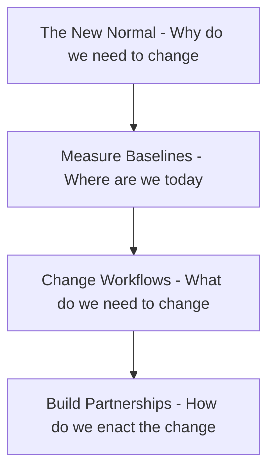

Okay - quick show of hands - anyone in the audience on support rotation this week?
Incidentally, I am on support this weekend for a system migration that's gone live and today the system is going to be put under some stress tests.
So I am just hoping this talk doesn't blow up on my face.

I know I'm holding you back from lunch, so I'll quickly introduce my self - my name is T, I work for London Stock Exchange group and handle things Site Reliability for the Low Latency group. I am developer turned SRE, so I used to create the bugs before - now I help ship them! #slide

This has given front row seats on many outages - and after the crisis is over and we are doing retrospective or post mortem, I have always found myself asking the question

We have patched the code. 
The hotfix has been deployed. 
Crisis is averted.
But what else needs to change other than code so that we are not here again?

So my goal for this talk to distill some of those learnings and hopefully it makes the life of the person on support a little less stressful.

## The New Normal - Why do we need to change
## Measure Baselines - Where are we today
## Change Workflows - What we do we need to change
## Build Partnerships - How do we enact the change

