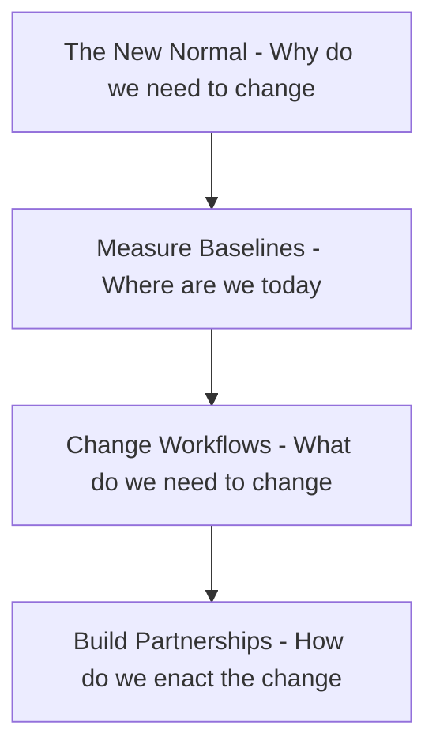

*Ding.*

It’s 9:35 a.m. on a Monday. Fifty-seven floors above the relentless pulse of New York’s financial district, a slack notification shows up on the support channel of the Ant Intelligence.
OpsGenie: “P1: Goldkern Husks: Dashboards not loading!!!”

Flick, from L1 support had barely taken the first sip of the coffee that morning as he notices the message.
Hopper is the top trader in the commodities trading division of Goldkern Husks - an name that sends chills through all of L1 support. 

Flick jumps between Slack, OpsGenie, Confluence, old jira tickets looking to troubleshoot somehow “dashboard outage.” "Empty dashboard".
After 10 minutes of frantic searching - he has nothing useful. 

@heimlich @atta.incidentmgr All GH dashboards are down. No visualizations. Client is blind. Need help ASAP.
Searched Confluence, runbooks. Need someone from the UI team to take a look!


Heimlich was about to go on his lunch break, as he saw the alert. Lunch is not happening today!

Is it just one client? One user? Did you ask them to clear their browser cache? Actually are they using a Supported browser? 
It might be their Firewall rule changes, can you ask to check if they are blocking websockets? And please ask them to include a few screenshots ... @Flik have you done a screenshare with any of the user?

Its past 10 o'clock and Flick can tell Hopper is losing it. 

```json
   "1720853740.000005": {
    "type": "message",
    "user_id": "W10000009",
    "text": "We need this fixed NOW. This is costing us millions.",
    "ts": "1720853740.000005"
},
```
Heimlich starts digging through logs - errors from third-party libraries - too noisy, he has been asking the team to do a clean up sprint for months - its so difficult to sift through this noise


```json
    Atta (atta.incidentmgr) escalates: @everyone Hopper has escalated to Antelligence execs. We need coordinated updates - why is our status page still showing healthy? Can the SRE team check? @manny
```

Manny, the SRE on support has been secretly larking on the chat.
He replies

```
   Well the health checks are passing - and we haven't seen any other
   clients complaining. I think it might be something on their side.
```

```
   Actually, I don't think it is them - and it isn't the UI team as well. Here, the row count in the json payload is showing zero.
   The backend API is not sending data. Most of the C++ guys are at CPPcon - @atta can you check who might be around?
```

```Well, unless there is a change why would it stop sending data all of a sudden? Do you know if they did a release this weekend?  
```

Hopper (hopper.debt) again: Still no data since market open. Losses are mounting. Top Antelligence execs are now on this thread.


Desperation sets in. 

```
Okay, no releases on ArgoCD - the pods are pretty old actually, I have also checked their logs no exceptions. However it looks like the service is constantly polling for data
```

```
Has anyone checked the Data team’s Airflow cluster?
```

```
The team lead of the Data Team is always on slack - within seconds he has checked his DataDog dasboards

“Wait. The nightly ticker load batch hasn’t completed yet—it should have completed before markets opened.”

Another 30 minutes crawl by.
Slim updates, “The job is stuck in a loop. It keeps trying to write its output file, but the disk is full. Every attempt to write fails with an ‘OSError: No space left on device,’ but the code just catches the error and tries again, over and over. There’s no backoff, no alert, and no exit condition. The job never finishes, and the pipeline is completely blocked.”

Atta frowns. “So the job is running, but it’s not making any progress?”

Slim nods. “Exactly. The dashboards are empty because the data never gets written. The job is just burning CPU, stuck in a futile loop, and no one noticed until now.”

```sre
    We havent seen any alerts come in for disk pressure. 
```

```
   Right ... there is a nightly cron job that cleans up T-1 files. Let me check if that is failing.
```

```
    Nothing in syslog - it is almost impossible to run any commands on that host, but looks like none of the files have been deleted.
    I am going to purge them manually and then restart the job!
    I am confident this will fix the issue - we will scale up the workers and we can clear up this queue within 2 hours. Please let the client know.
```

Later that day during the postmortem
```data
    I think I found the smoking gun ... 
    we made a change two weeks back where instead of writing one large file, we split it up the data and put them under a second level of directory by date. This change was done in the Airflow dag code.
    The clean up process that is scheduled in cron was doing `rm -f` and silently failing to delete the files under this directory.
    It started filling up this disk which does not have any monitoring
    attached to it - so SREs never got any alerts! And it all manifested like this - the fix is really simple just one character add a -r in the cron jobs and we are done with this bug!
```

```
    Your patch fixed the bug. But what else needs a patch?
```

```
    What do you mean?
```

To be Continued ... 


Okay - quick show of hands - anyone in the audience on support rotation this week?
Incidentally, I am on support this weekend for a system migration that's gone live and today the system is going to be put under some stress tests.
So I am just hoping this talk doesn't blow up on my face.

I know I'm holding you back from lunch, so I'll quickly introduce my self - my name is T, I work for London Stock Exchange group and handle things Site Reliability for the Low Latency group. I am developer turned SRE, so I used to create the bugs before - now I help ship them! #slide

This has given front row seats on many outages - and after the crisis is over and we are doing retrospective or post mortem, I have always found myself asking the question

We have patched the code. 
The hotfix has been deployed. 
Crisis is averted.
But what else needs to change other than code so that we are not here again?

So my goal for this talk to distill some of those learnings and hopefully it makes the life of the person on support a little less stressful.

## The New Normal - Why do we need to change
## Measure Baselines - Where are we today
## Change Workflows - What we do we need to change
## Build Partnerships - How do we enact the change



Now before we dive in, we first need to realize features and bugs have the complete opposite life cycle

Features are nurtured by Product teams with PRDs, design docs, ui mock ups, get all the drum rolls in release notes
Bugs tend to originate in production as ugly stack trace, alarms, outages, and are always hidden in foot note - miscellaneous bug fixes.

Bugs are the unwanted orphans - hated by users, stakeholders, developers, sre, even QAs. 
We want them squashed, we announce bounties to eradicate them. 
Even our favorite tools have language that makes shame those who introduced that bug.


# Why do we need to change our attitude towards bugs?

#TODO slide – Flick with his back to the audience, shoulders drooping in shame. A small rock next to him on one side, and his other inventions broken beside him.

A bug reduces the value delivered to the customer.
A bug can lead to financial loss, reputational damage, even loss of human life.
A bug is a sign that due diligence was not done before shipping.

All best practices in software engineering tell us that prioritizing speed over quality increases the likelihood of bugs.
So the question is: Can we balance innovation and reliability without compromising either?

Here we are in mid-2025, when vibe coding has become the new normal.
LLM-generated code is routinely checked into production.
It is now more important than ever that our attitude toward bugs changes.

We must accept that bugs are inevitable—and focus instead on building strong guardrails that minimize their blast radius.
We need to study patterns, anticipate failure modes, and treat bugs as learning checkpoints—not personal failures.
This shift in mindset demands that we treat debugging as a discipline, not just occasional damage control.

How we respond to a bug—and use it as an opportunity to plug the gaps in our software development life cycle — will determine whether we can continue to deliver value to our customers and keep up with the pace with which technology is changing.
Continuous Questioning - how can we prevent bugs even before code is written# What Needs to Change Other Than Code

We are probably all very familiar with code coverage, test pass rate, story points, velocity as developers.
I am going to touch a little about briefly about some metrics that are popular in DevOps/SRE zeitgeist.
[MetricsMeme](../slides/slides.md#metrics_meme)
[DORA Metrics](../slides/slides.md#dora-metrics-as-your-north-star)

**Deployment Frequency**: How often are you shipping?
This is probably my favorite metrics among everything - how often teams ship tells a lot about the maturity of 
a team. 
If you are in the first line then congratulations, but for the rest of us this is really the north star.
If you want to take away just one take away from this talk, then let this be it - zoom in on deployment frequency as your north star.

| Deployment Frequency | Description |
|-----------------------|-------------|
| Daily or On-Demand   | High-performing teams deploy multiple times per day |
| Weekly               | Medium-performing teams deploy weekly |
| Monthly or Quarterly | Low-performing teams deploy infrequently |

**Lead Time to Change**: Commit to production time
Lead time to change is a fine grain measurement that will give you answers to why you cannot deploy faster.
Are there multiple manual steps in your deployments?
Is there a limitation in your system architecture that you can not deploy without downtime?
Do you need to three levels of approval before deploying an emergency change?
Are upstream dependencies or downstream impacts slowing you down?


| Lead Time to Change | Description |
|----------------------|-------------|
| <1 Day              | High-performing teams deliver changes quickly |
| 1-7 Days            | Medium-performing teams take a few days |
| >7 Days             | Low-performing teams take weeks or longer |

**Change Failure Rate**: What percentage breaks production?
This metrics helps you understand why did your changes break in production? 
Are there brittle areas in your code that keep breaking frequently?
You know that it needs to be refactored, but you don't have the time to do it?
What are the gaps in your testing pyramid that you could not catch the bug before release?
The gap between test and prod is where bugs hide
Is the velocity, variety, and volume of your test data good enough?
Is prod like is your non-production environment?
Different data volume, variety, velocity
Different infrastructure, dependencies, configurations

| Change Failure Rate | Description |
|----------------------|-------------|
| 0-15%               | High-performing teams experience minimal failures |
| 16-30%              | Medium-performing teams encounter occasional failures |
| >30%                | Low-performing teams face frequent failures |

**Mean Time to Recovery**: How fast do you bounce back?
Your customers are not your alert system
**Alert Volume**: Are you drowning teams in noise? (Alert fatigue kills response)
**Alert Quality**: Do alerts explain the problem AND the next action?
**Purpose Clarity**: Dashboards are for debugging. Alerts are for action.
Are your Runbooks, support rotation, Upcoming release pages up to date?
What are the knowledge and access control gaps in your team?
Are they feeling safe during a crisis?
Do you have a back up plan when the key people are unavailable?

| Mean Time to Recovery | Description |
|------------------------|-------------|
| <1 Hour               | High-performing teams recover quickly |
| 1-24 Hours            | Medium-performing teams take some time |
| >24 Hours             | Low-performing teams take a day or more |


**A bug is never just a code change.** It's:
- Reproducing the problem reliably
- Understanding system interactions
- Coordinating across teams and timezones  
- Making tradeoff decisions under pressure
- Building processes that prevent recurrence
- Writing tests, documentation, runbooks
- Training teammates on new processes


# What Needs to Change Other Than Code

**How to Use**: 
- Identify where your team stands for each metric
- Prioritize which metric 
- Use these metrics as a guide to prioritize process and tooling enhancements.

I leaned in on the popular DORA metrics for finding where we are today.
However for the What part, it is really difficult to give a one size fits all answer.
It really depends on your team, your organization, your culture, your product.
Instead, I will talk about some principles that is very dear to SRE and DevOps community.

## Shift left Basic idea
Shift left is not something new as a concept.
Anyone who has done TDD, or BDD, or even just has already understood the value and experienced what it feels like to have that safety net.

So lets go from right to left and with DORA metrics as our guide lets see how we can shift left.

## Testing in Production
Now we know this is a controversial topic, but hear me out.
Netflix popularized the idea of testing in production with their Chaos Engineering.
While all teams might not have the bandwidth to deploy full fledged chaos engineering, we can still learn from the principles.
The key idea here is to test your assumptions in production with a controlled blast radius and then use the learnings to improve your code, your tests, and your processes.
If chaos engineering is too much of lift, you can still invest in post release testing that builds confidence on what your are shipping.

## Monitoring and Observability
Moving a step left, we can start with monitoring and observability.
If your customers are not your alert system, then you are doing it wrong.
As your system grows and changes, it is important to do periodic reviews of your alert thresholds and alerting rules.

## Pre-prod Testing

## The Developer's laptop
### Developer Environment Productivity
- pre-commit hooks, linters, static code quality, security scanning 
- DevContainers that allow you to run your code in a production-like environment
- Security scanning tools that can catch vulnerabilities before code is committed


## Requirements and Design
This is really ground zero for us.
This is before the code has been written when it is still a concept, a germ of an idea.
As of now, this is still a completely human process.
And a bug that that has its roots here is the most expensive bug to fix.
And accordingly this is the most difficult bug to fix.
As the roots of the bugs here are not in the code base, but in culture of the organization.
This is pure and raw human communication - and given neuralink is not yet a thing, we are still bottlenecked by what makes us human - our ability to communicate.
How we fix bugs here will take us to your next section - building partnerships

And this is where communication and team collaboration becomes the key.


We take that same idea and simply apply it across all aspects of software development.
What we want here to invest in tooling that makes writing buggy code difficult.
Up until a few years back, we were only doing static code analysis, linting, and unit tests within our development evironments. But now, it is possible to shift left even further.
Technologies like DevContainers allow us to spin up and tear down environments that are very close to what prodcution looks like.

Some of the examples of shift left tooling that you can use to prevent bugs even before code is written:


| **Shift-Left Idea**                        | **DORA Metric Impact**  | **How It Helps**                                                                      |
| ------------------------------------------ | ----------------------- | ------------------------------------------------------------------------------------- |
| **Automated CI/CD Pipelines**              | Deployment Frequency    | Enables faster, more frequent deployments with reduced cycle time.                    |
| **Test-Driven Development (TDD)**          | Lead Time for Changes   | Ensures high-quality code is developed faster with fewer defects.                     |
| **Feature Toggles**                        | Lead Time for Changes   | Decouples feature deployment from code release, reducing deployment time.             |
| **Automated Unit & Integration Tests**     | Change Failure Rate     | Catches bugs early to reduce failure rates in production.                             |
| **Shift-Left Security (DevSecOps)**        | Change Failure Rate     | Identifies and fixes vulnerabilities earlier to reduce security risks.                |
| **Automated Regression Testing**           | Change Failure Rate     | Prevents regressions that could cause issues in production.                           |
| **Automated Monitoring & Log Aggregation** | Time to Restore Service | Provides early insight into issues for faster recovery from incidents.                |
| **Chaos Engineering**                      | Time to Restore Service | Identifies system weaknesses before they impact production, enabling faster recovery. |
| **Infrastructure as Code (IaC)**           | Time to Restore Service | Ensures consistent environment provisioning and quicker recovery from failures.       |
| **Early Performance Testing**              | Time to Restore Service | Identifies and addresses performance issues before deployment.                        |


## Build and Release Pipeline


 


# What Needs to Change Other Than Code - Partnership

The distributed and connected nature of today's software is such that you cannot operate in silos.
You have multiple internal and external teams, you have open source dependencies. 
And all of your dependencies have their own goals and priorities.
Your emergency is not their priority.
Trust, empathy and honest communications are how you build great partnership.

## Empathy
Empathy is bandwidth—measured in time and dollars
So even if you are on a team that scores straight A-s on every metrics, that might not be true for your upstream or downstream teams. Your team is a part of a supply chain of values to the customer and the only thing that keeps this chain from breaking apart is trust.

## Trust
Trust is like cache - easier to build with locality of reference, when people get together same room. 

Remember at the other end of each line of code is a human being who wrote the code or the prompt
At the other end of your pr - there is a human being / should be a human being
Now this is not a AI talk, but I think as of middle of 2025, we are not there yet that we can ship code to prod without a human taking a look.
Humans are still kicking the rear side because of token limits.
So imagine all the meetings you have had, the emails, the jira tickets, the code that you have written, the previous bugs that you have written - in summary the context that you have, you are still the best MCP server the AI can plug into.
But the real reason might be in case of a crisis you trust a human to take responsibility, as we cannot yet sue AI!
Make judgment calls under pressure. Build trust between teams during crisis.


## Honest communication

Start from your deadlines and work backward to plan upstream and downstream dependencies.
If you don’t own your plan, someone else will—and they might get it wrong.
Announce early, recalibrate them openly when things change.
Share risks and tradeoffs early—transparency builds trust.
Even if you’re delayed, give teams a heads-up is all about setting and meeting expectations.
Pre-plan post-release verification with the right stakeholders, Make sure someone’s available to validate after the release.
Don’t just inform—ask for feedback. Adjust based on what you hear.
Your support calendar should be visible—with primary, backup, PTO, and how to engage, scope of your work
Now Ask other teams to do the same for you.
This creates an environment where people can speak up early—without fear of being wrong.


 


# Postmortem Actions Table

# Short Term

|**Team**| **What**                          |
|----|-------------------------------------|
|SRE | Alert on 85% of disk usage & Runbook update             | 
|Data| Error handling, move purger job to Airflow data  |
|UI  | Improve Signal to Noise ratio, refactoring third party lib errors         |
|C++ | Support rotation calendar update        |

---
# Long Term

| **Team** | **Focus**                                                                 | **DORA Metric**         |
|----------|-----------------------------------------------------------------------------|-------------------------|
| SRE      | Faster and reliable updates to production systems                          | Deployment Frequency    |
| C++      | Reduce build times and improve testing efficiency                          | Lead Time for Changes   |
| Data     | Enhance data quality in non-production environments                        | Change Failure Rate     |
| UI       | Implement synthetic UI tests, that will validate post release validations  | Time to Restore Service |

---
# Speaker Notes Narrative

In closing we return to the postmortem in Ant Intelligence.
The SRE had asked the question what else needed a patch?
Hours later, and a lot white boarding later, the teams came up with some short term and long term action items.


The SREs stepped in to put alerts around disk usage and a runbooks to safely remove old data
The Data team decided having an out of band purge process was a bad design - and would handle the whole processing in Airflow.
The UI team was happy to use this opprotunity to clean up some logging 
Since most of the C++ team was at a conference, it was decided they would update their support pages

For the long term the SRE decided their focus was going to be deployment frequency - no surprise there.
The Data team wanted to work on their change failure rate by copying over a representative sample of data from prod
The UI team started working on synthetic ui tests that would allow faster post release validation and reduce MTTR
For the C++ team, brining down C++ build times were the top priority.

## Closing Thoughts

The incident was a wake-up call for the organization. 
It highlighted the need for better monitoring, robust error handling, and improved cross-team coordination. 
The short-term actions address immediate gaps, while the long-term focus aims to build resilience and prevent future incidents. 
The question "What else needs a patch?" serves as a reminder that fixing the code is only part of the solution—the real work lies in addressing the underlying processes and systems.

