# <!--fit--> <span style="color:red;">Disclaimer</span>

--- 
# <span style="color:red;">Disclaimer</span>
The following narrative is a work of pure fiction.  

Any similarities to actual people, places, or events are entirely coincidental and absolutely unrelated to the speaker's professional life.  

Furthermore, the speaker categorically denies any emotional attachment to animated films featuring entrepreneurial insects.  

_This statement has been notarized by the Ministry of Totally Serious Bugs._

---


<!-- _class: split -->


---

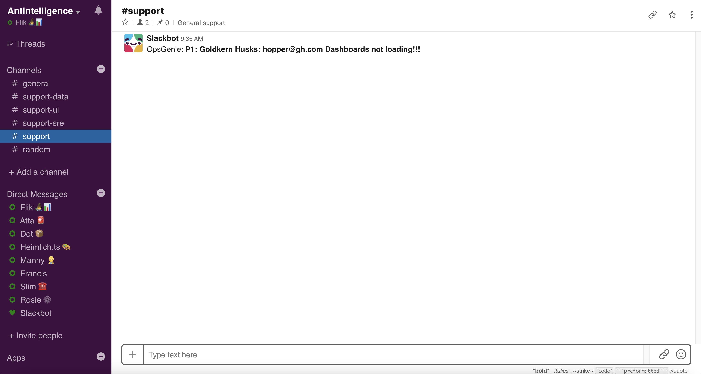

---

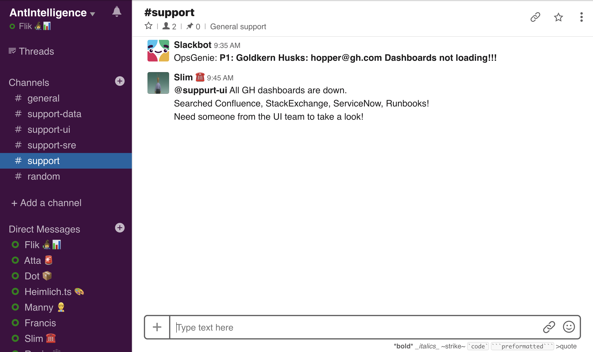

---

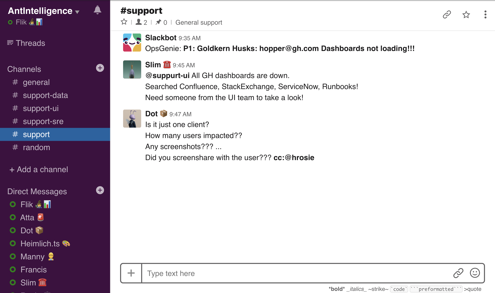

---

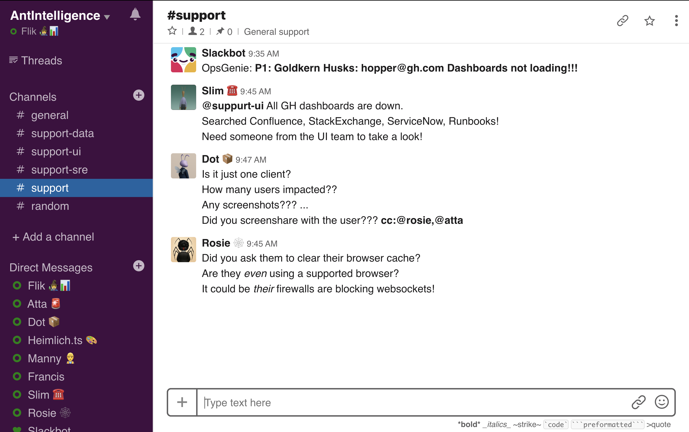

---
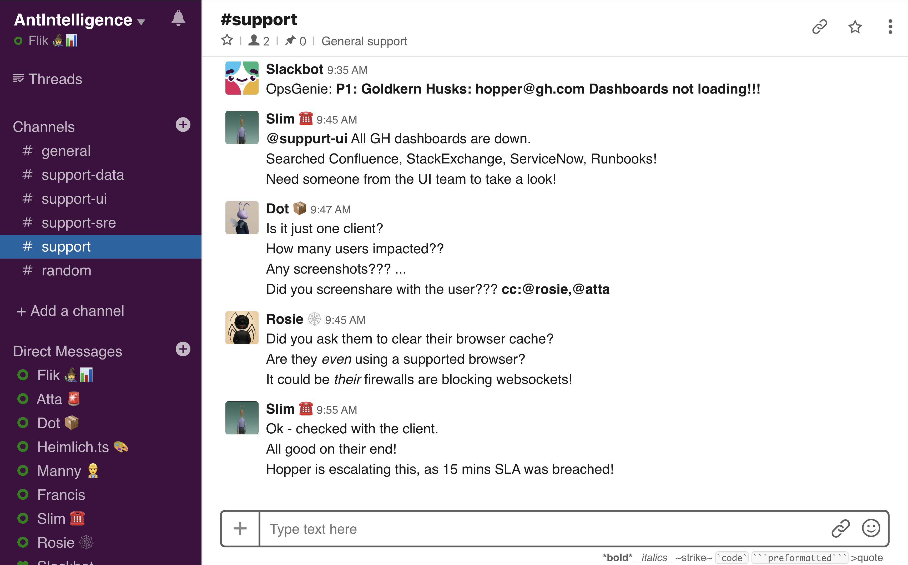


---

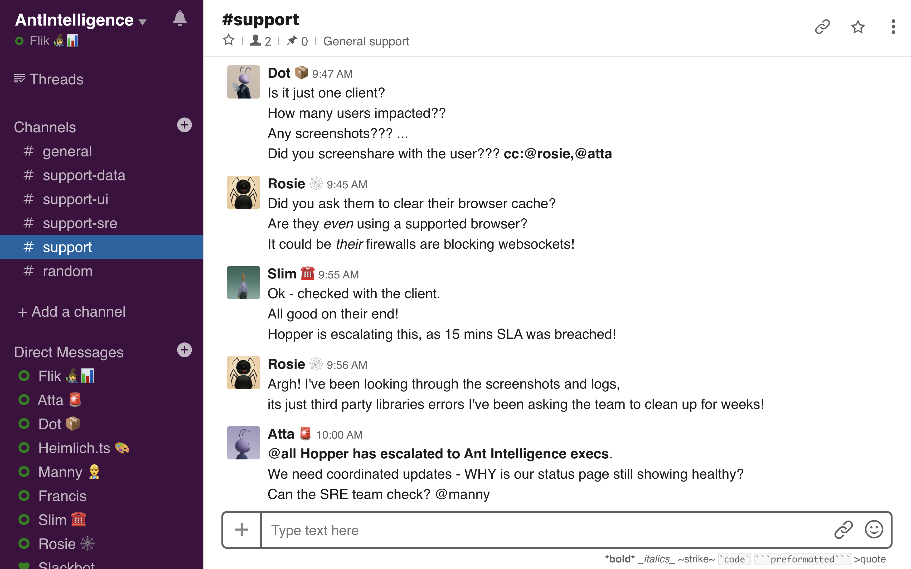

---
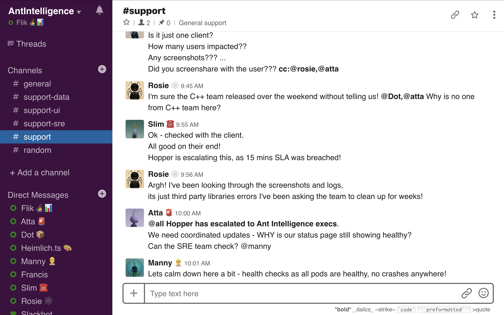

---
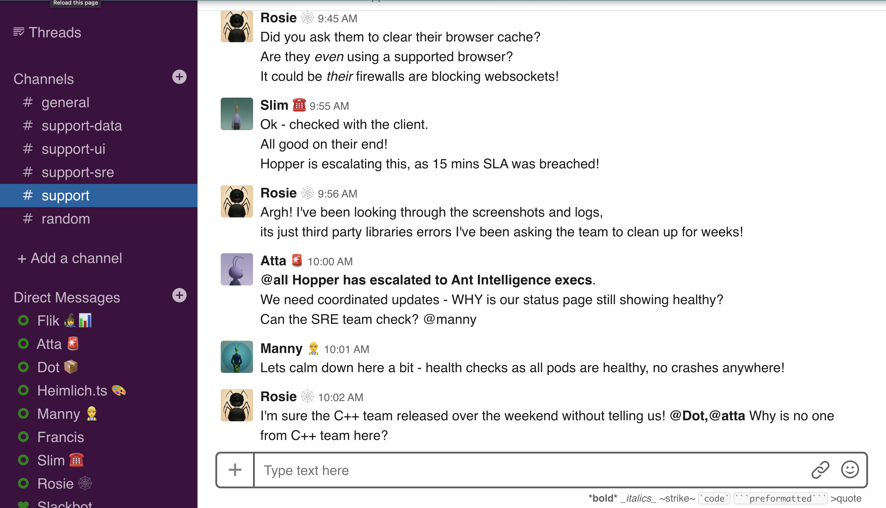

---

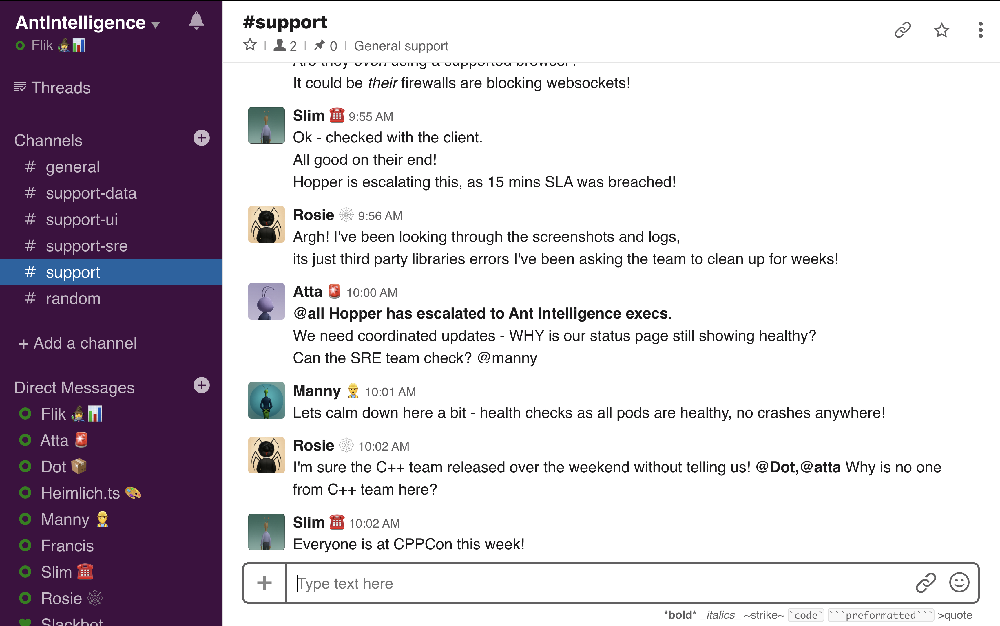

---

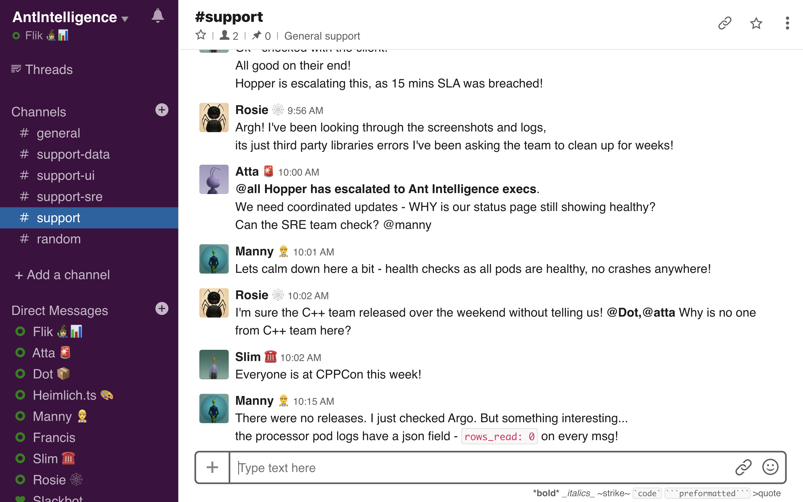

---

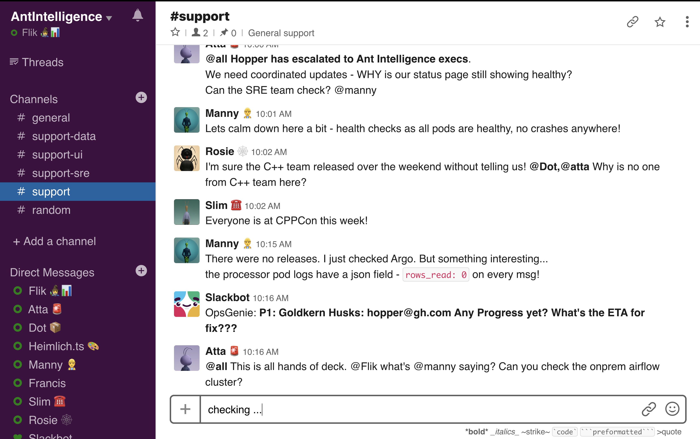

---

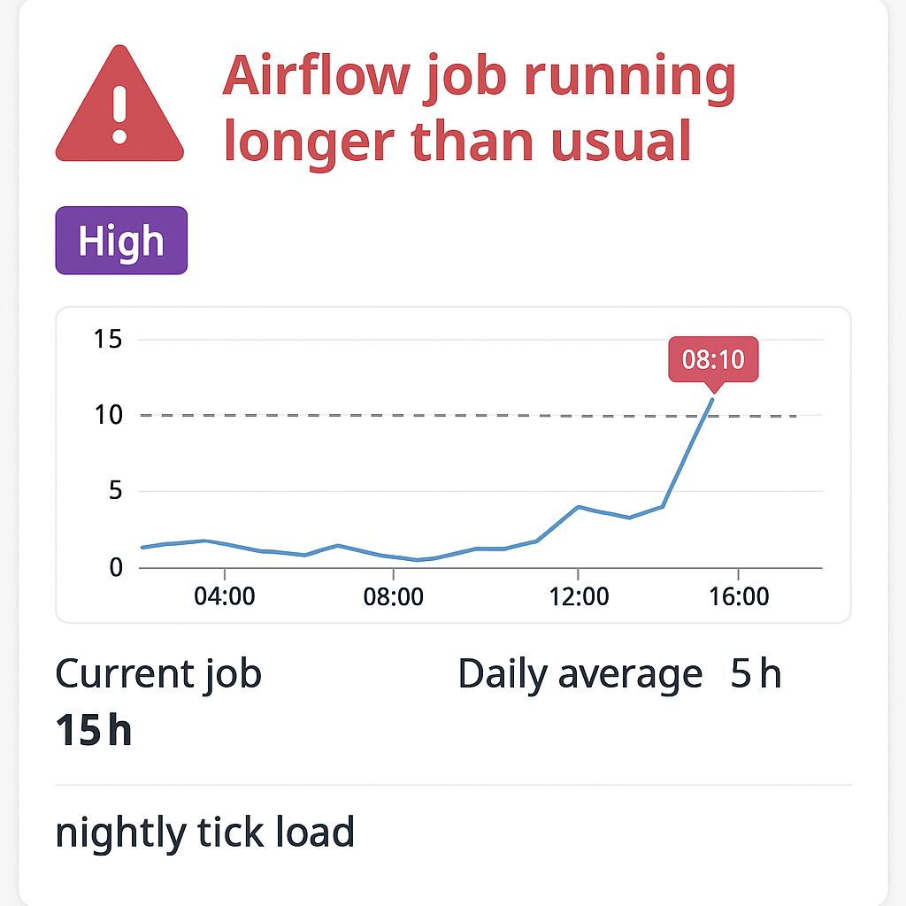

---

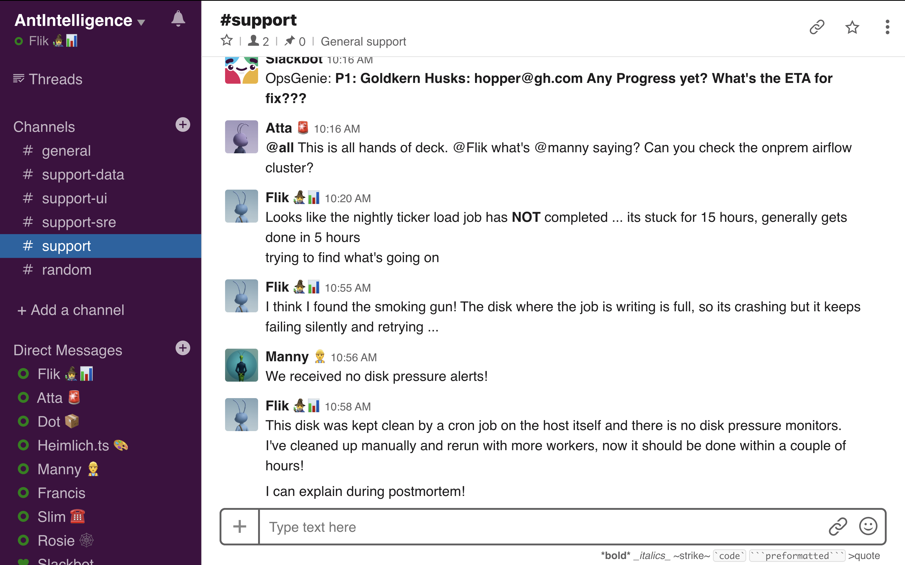


---

```bash
/data/nyse.ticker
/data/amex.ticker
/data/nasdaq.ticker
```
---

```
.
└── data
    ├── 2025-07-23
    │   ├── nyse.ticker
    │   ├── nasdaq.ticker
    | . |-- kraken.ticker
    │   └── amex.ticker
    ├── 2025-07-24
    │   ├── nyse.ticker
    │   ├── nasdaq.ticker
    │   └── amex.ticker
    └── 2025-07-25
        ├── nyse.ticker
        ├── nasdaq.ticker
        └── amex.ticker
```

---

```python
EXCHANGES = ["nyse", "nasdaq", "amex", "kraken"]
base_path = "/data"

for ex in EXCHANGES:
    file_path = os.path.join(base_path, f"{ex}.ticker")
    if os.path.exists(file_path):
        os.remove(file_path)
```


---

```python
import os

EXCHANGES = ["nyse", "nasdaq", "amex", "kraken"]
BASE_DIR = "/data"

for entry in os.listdir(BASE_DIR):
    day_dir = os.path.join(BASE_DIR, entry)
    if os.path.isdir(day_dir):
        for ex in EXCHANGES:
            file_path = os.path.join(day_dir, f"{ex}.ticker")
            if os.path.exists(file_path):
                os.remove(file_path)
                print(f"Deleted: {file_path}")

```
---
# <!--fit--> To Be Continued ...

---


Tathagata Dasgupta (T)
Low Latency Engineering

---

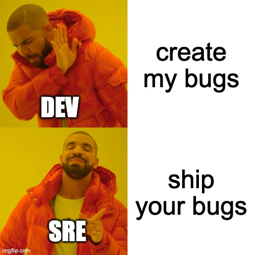
  

---
<!-- _class: split -->

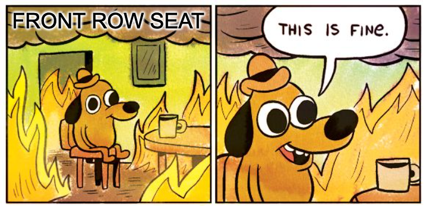
✅ Patch deployed ➡️ bug is fixed


---

                ➡️ What else needs a patch?
                 

---

🐞 The New Normal

📊 Measure Baselines 

🔄 Change Workflows 

🤝 Build Partnerships

---
🐞 The New Normal  &nbsp;&nbsp;&nbsp;&nbsp;&nbsp;&nbsp;&nbsp;&nbsp; <span style="color:red;">_Why_</span> change our attitude toward bugs?  

📊 Measure Baselines 

🔄 Change Workflows   

🤝 Build Partnerships

---
🐞 The New Normal  &nbsp;&nbsp;&nbsp;&nbsp;&nbsp;&nbsp;&nbsp;&nbsp; <span style="color:red;">_Why_</span> change our attitude toward bugs?  

📊 Measure Baselines  &nbsp;&nbsp;&nbsp;&nbsp;&nbsp;<span style="color:red;">_Where_</span> are we today?  

🔄 Change Workflows   

🤝 Build Partnerships  

---
🐞 The New Normal  &nbsp;&nbsp;&nbsp;&nbsp;&nbsp;&nbsp;&nbsp;&nbsp; <span style="color:red;">_Why_</span> change our attitude toward bugs?  

📊 Measure Baselines  &nbsp;&nbsp;&nbsp;&nbsp;&nbsp;<span style="color:red;">_Where_</span> are we today?  

🔄 Change Workflows  &nbsp;&nbsp;&nbsp;&nbsp; <span style="color:red;">_What_</span> needs to change?  

🤝 Build Partnerships

---

🐞 The New Normal  &nbsp;&nbsp;&nbsp;&nbsp;&nbsp;&nbsp;&nbsp;&nbsp; <span style="color:red;">_Why_</span> change our attitude toward bugs?  

📊 Measure Baselines  &nbsp;&nbsp;&nbsp;&nbsp;&nbsp;<span style="color:red;">_Where_</span> are we today?  

🔄 Change Workflows  &nbsp;&nbsp;&nbsp;&nbsp; <span style="color:red;">_What_</span> needs to change?  

🤝 Build Partnerships  &nbsp;&nbsp;&nbsp;&nbsp;&nbsp;&nbsp; <span style="color:red;">_How_</span> do we make it happen?  

---

# 🐞 The New Normal  
<span style="color:red;">_Why_</span> change our attitude toward bugs?


---
<!-- _class: split -->

# <span style="color:red;">BUGS == LOSS</span>


➡️ **value to the customer**


---

<!-- _class: split -->

# <span style="color:red;">BUGS == LOSS</span>
➡️ value to the customer 
➡️ **financial**, reputation, human life


---

<!-- _class: split; -->

# <span style="color:red;">BUGS == LOSS</span>
➡️ value to the customer 
➡️ financial, **reputation**, human life

---

<!-- _class: split -->

# <span style="color:red;">BUGS == LOSS</span>
➡️ value to the customer 
➡️ financial, reputation, **human life**

---
<!-- _class: split -->
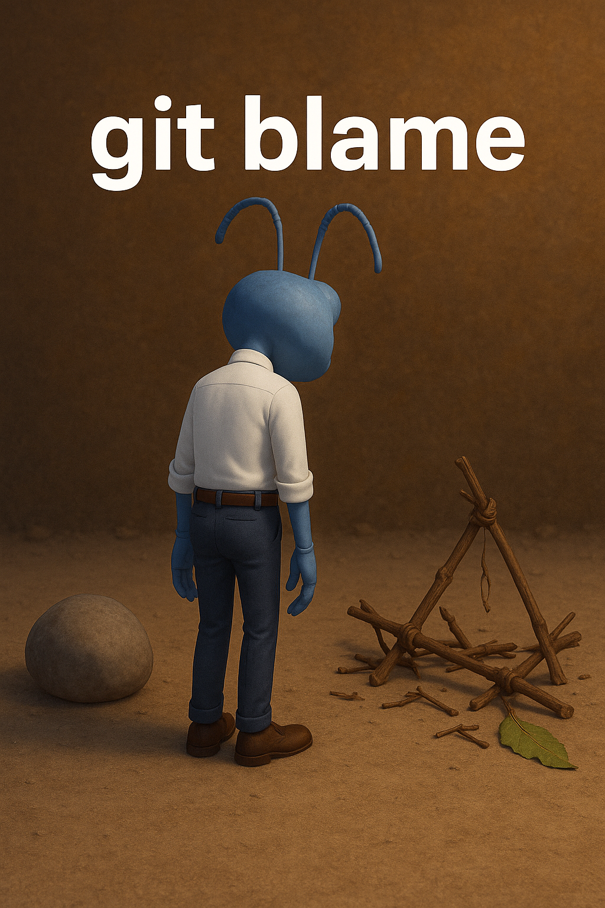
# <span style="color:red;">BUGS == BLAME</span>
➡️ value to the customer 
➡️ financial, reputation, human life
➡️ **pride, ownership, craftsmanship**

_hasn't this always been like that?_

---

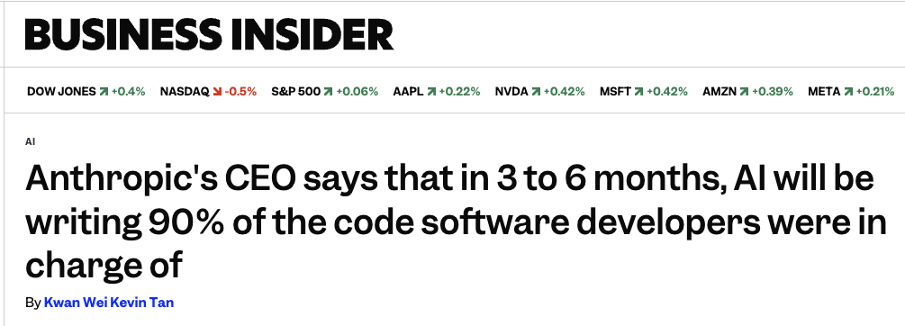


---
<!-- _class: split -->
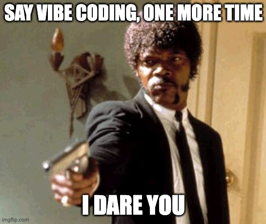
⚡ Coding at the speed of thought
🦥 Debugging at the speed of sloth 

---
<!-- _class: split -->
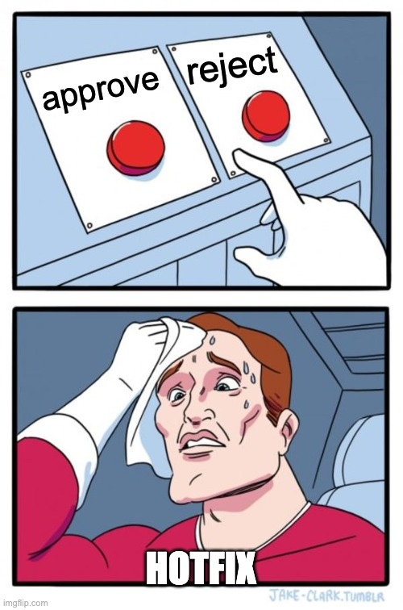
# <span style="color:red;">Mo code, mo bugs</span>
➡️ blame the author
➡️ blame the ~~author~~ reviewer
➡️ blame the ~~author~~ ~~reviewer~~ agent?

---


---


---
# 🐞 Right Mindset

* opportunity to plug the gaps, not a blame game
* learning checkpoints, not personal failures
* debugging as a discipline, not just occasional damage control
---

# 📊 Measure Baselines  
<span style="color:red;">_Where_</span> are we today? 

---
<!-- _class: split -->
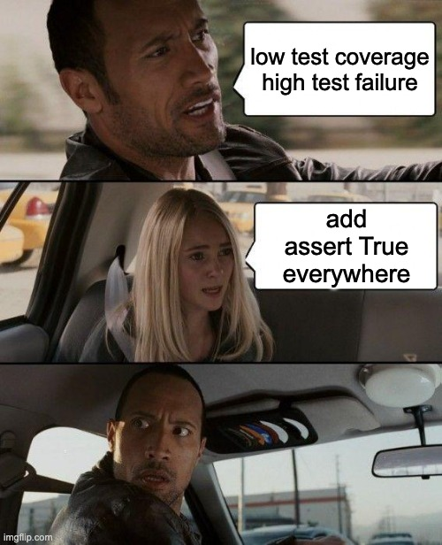
> If you can't measure it, you can't improve it.
* code coverage
* test pass rate
* cyclomatic complexity

---

# Yet more metrics
<!-- _class: split -->

DORA
DevOps Research and Assessment 

---
## How often do you deploy?

| **Metric**               | **High Performers**       | **Mid Performers**        | **Low Performers**        |
|---------------------------|---------------------------|----------------------------|----------------------------|
| **Deployment Frequency**  | **Multiple times/day**    | Weekly to monthly          | Less than monthly          |

* one metric to rule them all 💕

---

## Why you cannot deploy faster?
<!-- _class: split -->
| **Metric**               | **High Performers**       | **Mid Performers**        | **Low Performers**        |
|---------------------------|---------------------------|----------------------------|----------------------------|
| **Lead Time for Changes** | **Hours**                | Days                       | Weeks to months            |

> Too many manual steps?
> Slow build times?
> Slow test execution?
> Too many approvals?
> Architectural limitations to achieve zero downtime deployments?
> Upstream dependencies and Downstream impact?

---

## How often do your changes fail?

| **Metric**               | **High Performers**       | **Mid Performers**        | **Low Performers**        |
|---------------------------|---------------------------|----------------------------|----------------------------|
| **Change Failure Rate**   | **<15%**                 | 15-30%                     | >30%                       |
> Technical debt with brittle areas in the code base that need refactoring?
> Are there gaps in your testing pyramid?
> Are new tests getting added for every bug fix?
> Are regression tests flaky?
> Does your pre-prod environment mirror production?
> Quality of Test data - velocity, variety, volume?


---

## How fast do you bounce back?

| **Metric**               | **High Performers**       | **Mid Performers**        | **Low Performers**        |
|---------------------------|---------------------------|----------------------------|----------------------------|
| **Time to Restore Service** | **<1 hour**             | <1 day                     | >1 day                     |
> Are the Alert Quality and Volume good enough? 
> Are your runbooks, support rotation, upcoming release pages up to date? 
> Are there knowledge and access control gaps in your team? 
> Are the team members feeling safe during a crisis? 
> Are there back up plan when the key people are unavailable?

---
## DORA
| **Metric**               | **High Performers**       | **Mid Performers**        | **Low Performers**        |
|---------------------------|---------------------------|----------------------------|----------------------------|
| **Deployment Frequency**  | Multiple times/day        | Weekly to monthly          | Less than monthly          |
| **Lead Time for Changes** | Hours                    | Days                       | Weeks to months            |
| **Change Failure Rate**   | <15%                     | 15-30%                     | >30%                       |
| **Time to Restore Service** | <1 hour                 | <1 day                     | >1 day                     |

---

🔄 Change Workflows  &nbsp;&nbsp;&nbsp;&nbsp; <span style="color:red;">_What_</span> needs to change? 

---

<!-- _class: split -->
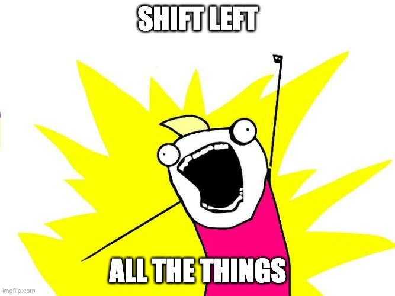
* Test Driven Development
* Pair Programming

---

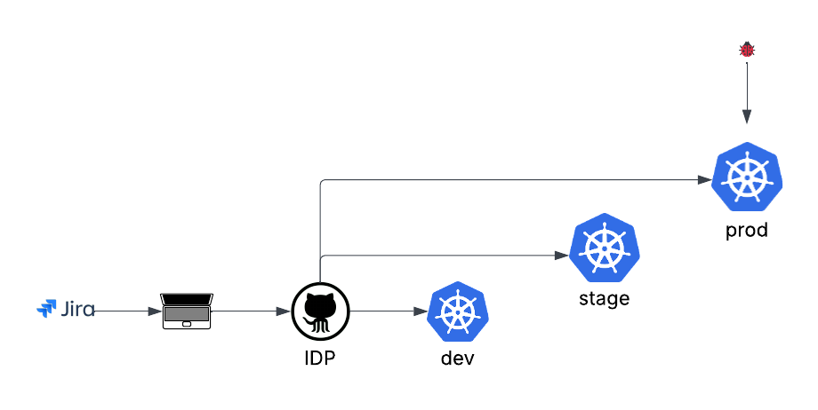

---

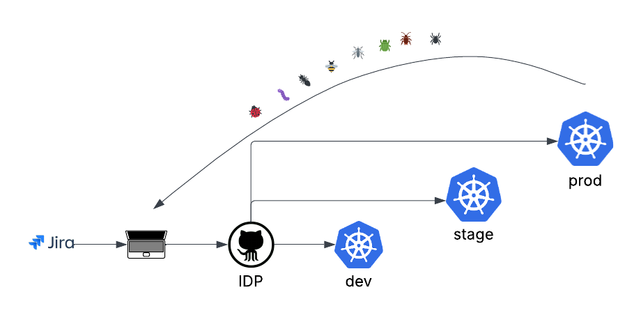

---
<!-- _class: split -->

# Deployments
- **Blue Green, Canary**
- **Synthetic Monitoring**
- **Feature Flags**
- **Chaos Engineering**

---


<!-- _class: split -->

# Observability
> Customer should not be part of your monitoring stack!
- Actionable alerts, not noise
- Dashboards for debugging, alerts for action
- Logs, Metrics, Traces are the besties you need
- Periodic reviews of alert and thresholds

---


# Dev Experience
> Happy devs ship better code 
- DevContainers
- Pre-commit Hooks for Lint, Code Quality, Security Scanning
- Meta prompts (CLAUDE.md)

---

# Partnership 
> bugs that happen before the code
- Empathy
- Trust
- Honest Communication

---
<!-- _class: split -->


---

# Postmortem Action Items

**WHO** does **WHAT** by **WHEN**


---
# Short Term

|**Team**| **What**                          |
|----|-------------------------------------|
|SRE | Alert on 85% of disk usage & Runbook update             | 
|Data| Add tests and error handling, move purger job to Airflow  |
|UI  | Improve Signal to Noise ratio, refactoring third party lib errors         |
|C++ | Update Support rotation calendar, ensure secondary support person        |


---
# Long Term

| **Team** | **Focus**                                                                 | **DORA Metric**         |
|----------|----------------------------------------------------------------------------|-------------------------|
| SRE      | Notifications for releases and drift detection to keep everyone informed   | Deployment Frequency    |
| C++      | Reduce build times by 5%                                                   | Lead Time for Changes   |
| Data     | Enhance data quality in non-production environments                        | Change Failure Rate     |
| UI       | Implement synthetic UI tests for post release validations                  | Time to Restore Service |

---

A bug fix is rarely a quick code change.
A bug's life is a lesson in software development.

_What else needs a patch_?
Is it our architecture? Our processes? Or is it us?

Technology will keep moving faster than we can keep up with.
Crisis will always be a part of software development.

How we respond to change and crisis, will define us and our products.
So lets be little kind to each other, and also to ourselves.

---

