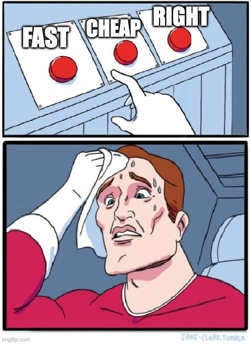

# <!--fit--> Disclaimer

--- 
# Disclaimer
The following narrative is a work of pure fiction.  

Any similarities to actual people, places, or events are entirely coincidental and absolutely unrelated to the speaker's professional life.  

Furthermore, the speaker categorically denies any emotional attachment to animated films featuring entrepreneurial insects.  

_This statement has been notarized by the Ministry of Totally Serious Bugs._

---

<!-- _class: split -->

---

# <!--fit--> To Be Continued ...

---

Tathagata Dasgupta (T)
Low Latency Engineering Group

---

  

---
<!-- _class: split -->

✅ Patch deployed ➡️ Crisis averted

---

                ➡️ Will it come back? 
                ➡️ What else needs a patch?
                 

---

🐞 The New Normal

📊 Measure Baselines 

🔄 Change Workflows 

🤝 Build Partnerships

---
🐞 The New Normal  &nbsp;&nbsp;&nbsp;&nbsp;&nbsp;&nbsp;&nbsp;&nbsp; _Why_ change our attitude toward bugs?  

📊 Measure Baselines 

🔄 Change Workflows   

🤝 Build Partnerships

---
🐞 The New Normal  &nbsp;&nbsp;&nbsp;&nbsp;&nbsp;&nbsp;&nbsp;&nbsp; _Why_ change our attitude toward bugs?  

📊 Measure Baselines  &nbsp;&nbsp;&nbsp;&nbsp;&nbsp;_Where_ are we today?  

🔄 Change Workflows   

🤝 Build Partnerships  

---
🐞 The New Normal  &nbsp;&nbsp;&nbsp;&nbsp;&nbsp;&nbsp;&nbsp;&nbsp; _Why_ change our attitude toward bugs?  

📊 Measure Baselines  &nbsp;&nbsp;&nbsp;&nbsp;&nbsp;_Where_ are we today?  

🔄 Change Workflows  &nbsp;&nbsp;&nbsp;&nbsp; _What_ needs to change?  

🤝 Build Partnerships

---

🐞 The New Normal  &nbsp;&nbsp;&nbsp;&nbsp;&nbsp;&nbsp;&nbsp;&nbsp; _Why_ change our attitude toward bugs?  

📊 Measure Baselines  &nbsp;&nbsp;&nbsp;&nbsp;&nbsp;_Where_ are we today?  

🔄 Change Workflows  &nbsp;&nbsp;&nbsp;&nbsp; _What_ needs to change?  

🤝 Build Partnerships  &nbsp;&nbsp;&nbsp;&nbsp;&nbsp;&nbsp; _How_ do we make it happen?  

---

# 🐞 The New Normal  
_Why_ change our attitude toward bugs?

---
<!-- _class: split -->
# LOSS
---

<!-- _class: split -->

# LOSS

➡️ **value to the customer**

---

<!-- _class: split -->

# LOSS
➡️ value to the customer 
➡️ **financial**, reputation, human life
➡️ pride, ownership, craftsmanship

---

<!-- _class: split; invert -->

# LOSS
➡️ value to the customer 
➡️ financial, **reputation**, human life
➡️ pride, ownership, craftsmanship

---

<!-- _class: split -->

# LOSS
➡️ value to the customer 
➡️ financial, reputation, **human life**
➡️ pride, ownership, craftsmanship

---
<!-- _class: split -->

# BLAME
➡️ value to the customer 
➡️ financial, reputation, human life
➡️ **pride, ownership, craftsmanship**

---
<!-- _class: split -->

# BLAME, yet ...
➡️ Unrealistic Deadlines
➡️ Tradeoffs
➡️ Ever changing landscape

---

---
<!-- _class: split -->

⚡ Coding at the speed of thought
🦥 Debugging at the speed of sloth 

---
# 🐞 Right Mindset

* opportunity to plug the gaps, not a blame game
* learning checkpoints, not personal failures
* debugging as a discipline, not just occasional damage control
---

# 📊 Measure Baselines  
_Where_ are we today? 

---
<!-- _class: split -->

> If you can't measure it, you can't improve it.
* code coverage
* test pass rate
* cyclomatic complexity

---

# Yet more metrics
<!-- _class: split -->

DORA
DevOps Research and Assessment 

---
## How often do you deploy?

| **Metric**               | **High Performers**       | **Mid Performers**        | **Low Performers**        |
|---------------------------|---------------------------|----------------------------|----------------------------|
| **Deployment Frequency**  | **Multiple times/day**    | Weekly to monthly          | Less than monthly          |

* one metric to rule them all 💕

---

## Why you cannot deploy faster?
<!-- _class: split -->
| **Metric**               | **High Performers**       | **Mid Performers**        | **Low Performers**        |
|---------------------------|---------------------------|----------------------------|----------------------------|
| **Lead Time for Changes** | **Hours**                | Days                       | Weeks to months            |

> Too many manual steps?
> Slow build times?
> Slow test execution?
> Too many approvals?
> Architectural limitations to achieve zero downtime deployments?
> Upstream dependencies and Downstream impact?

---

## How often do your changes fail?

| **Metric**               | **High Performers**       | **Mid Performers**        | **Low Performers**        |
|---------------------------|---------------------------|----------------------------|----------------------------|
| **Change Failure Rate**   | **<15%**                 | 15-30%                     | >30%                       |
> Technical debt with brittle areas in the code base that need refactoring?
> Are there gaps in your testing pyramid?
> Are new tests getting added for every bug fix?
> Are regression tests flaky?
> Does your pre-prod environment mirror production?
> Quality of Test data - velocity, variety, volume?

---

## How fast do you bounce back?

| **Metric**               | **High Performers**       | **Mid Performers**        | **Low Performers**        |
|---------------------------|---------------------------|----------------------------|----------------------------|
| **Time to Restore Service** | **<1 hour**             | <1 day                     | >1 day                     |
> Are the Alert Quality and Volume good enough? 
> Are your runbooks, support rotation, upcoming release pages up to date? 
> Are there knowledge and access control gaps in your team? 
> Are the team members feeling safe during a crisis? 
> Are there back up plan when the key people are unavailable?

---
## DORA
| **Metric**               | **High Performers**       | **Mid Performers**        | **Low Performers**        |
|---------------------------|---------------------------|----------------------------|----------------------------|
| **Deployment Frequency**  | Multiple times/day        | Weekly to monthly          | Less than monthly          |
| **Lead Time for Changes** | Hours                    | Days                       | Weeks to months            |
| **Change Failure Rate**   | <15%                     | 15-30%                     | >30%                       |
| **Time to Restore Service** | <1 hour                 | <1 day                     | >1 day                     |

---

🔄 Change Workflows  &nbsp;&nbsp;&nbsp;&nbsp; _What_ needs to change? 

---
## 
<!-- _class: split -->

* Test Driven Development
* Pair Programming
---

# Testing in Production: The Ultimate Truth

- **Chaos Engineering**: Intentionally break things to find weaknesses
- **Canary Deployments**: Let production tell you what's wrong  
- **Feature Flags**: Instant rollback without redeployment

**Game Changer**: DevContainers bring production to your laptop

---

# Monitoring and Observability

**Red Flag**: If customers report issues before your monitoring does, your monitoring is broken.
* Periodic reviews of alert thresholds
* Actionable alerts, not noise
* Dashboards for debugging, alerts for action
* Automate runbooks to alerts for context
* Logs are your best friend
* Metrics are your second best friend
* Traces are your third best friend
---

| **DORA Metric**       | **Shift-Left Workflow Change**                                                                 |
|-----------------------------|--------------------------------------------------------------------------------------|
| Deployment Frequency        | Canary Deployments                                                                  |
| Lead Time for Changes       | Pre-commit Hooks for   Linters    Static Code Quality Checks    Security Scanning       |
| Change Failure Rate         | **Test-Driven Development (TDD)**    **Unit Test Coverage Gates**                |
| Mean Time to Recovery (MTTR)| Feature Flags                                     |

---

# The Bug Story Had:
- Zero disk monitoring
- Zero alerts  
- Job silently failed for hours

---

# Three Monitoring Questions Every Bug Should Ask:

1. **Alert Volume**: Are you drowning teams in noise? *(Alert fatigue kills response)*
2. **Alert Quality**: Do alerts explain the problem AND the next action?
3. **Purpose Clarity**: Dashboards are for debugging. Alerts are for action.

---

# Remember:

> A dashboard is a debugger,  
> not an early warning system.

---

# 3. Tooling Enhancements
## The Human Factors

---

# Communication in Crisis

The bug story shows coordination chaos:
- Multiple Slack channels
- Different teams, different tools
- Remote, hybrid, multiple timezones
- Stakeholder pressure escalating

---

# Process Gaps Kill Velocity

**Questions your next bug will ask:**
- Who owns the support rotation? 
- Who verifies weekend releases?
- What happens when the expert is at a conference?
- How do you hand off context across time zones?

---

# The Locality of Reference Problem

**Knowledge lives in silos.**
- Person who wrote the code moved teams
- Runbook is outdated  
- Tribal knowledge walked out the door

**Solution**: Documentation that lives with the code, not in wikis that rot

---

# The AI Question
## Will Robots Take Our Debugging Jobs?

---

# What AI Can Do:
Generate code from prompts

# What AI Can't Do:
- Navigate coordination chaos
- Understand business context
- Make judgment calls under pressure  
- Build trust between teams during crisis

---

# A Bug Is Never Just a Code Change

It's:
- Reproducing the problem reliably
- Understanding system interactions
- Coordinating across teams and timezones  
- Making tradeoff decisions under pressure
- Building processes that prevent recurrence

---

# The 90% That Matters Most?

**That's still human work.**

---

# The Mindset Shift
## From Pets to Partners

---

# Features vs Bugs: The Adoption Gap

**Features** are planned, nurtured, celebrated—they're **pets**  
**Bugs** are unwanted orphans that nobody claims—treated like **pests**

**Truth**: Bugs teach you more about your system than features ever will.

---

# Three Organizational Problems Every Team Faces

---

# Problem 1: Empathy Deficit

**Solution**: Bugs are inevitable. Budget for them.
- Empathy is bandwidth—measured in time and dollars
- Features add revenue, bugs subtract it
- **Both deserve equal investment**

---

# Problem 2: Timeline Ownership

**Solution**: Self-empowered teams forecast their own timelines
- Plan backwards from release day
- Map dependencies, approvals, tech debt blockers
- **If you don't plan it, someone unqualified will**

---

# Problem 3: CICD as Assembly Line

**Solution**: Your CICD is Ford's conveyor belt—but are you using all its features?
- Team integration via webhooks and APIs
- **If shipping takes more than two weeks, you're waiting too long**

---

# The Production Gap

Your test environment is production's distant cousin:
- Different data volume, variety, velocity
- Different infrastructure, dependencies, configurations
- **The gap between test and prod is where bugs hide**

---

# Solution:

> Bring production closer to development,  
> not the other way around.

---

# Postmortem Action Items

**WHO** does **WHAT** by **WHEN**

---
# Short Term

|**Team**| **What**                          |
|----|-------------------------------------|
|SRE | Alert on 85% of disk usage & Runbook update             | 
|Data| Error handling, move purger job to Airflow data  |
|UI  | Improve Signal to Noise ratio, refactoring third party lib errors         |
|C++ | Support rotation calendar update        |

---
# Long Term

| **Team** | **Focus**                                                                 | **DORA Metric**         |
|----------|-----------------------------------------------------------------------------|-------------------------|
| SRE      | Faster and reliable updates to production systems                          | Deployment Frequency    |
| C++      | Reduce build times and improve testing efficiency                          | Lead Time for Changes   |
| Data     | Enhance data quality in non-production environments                        | Change Failure Rate     |
| UI       | Implement synthetic UI tests, that will validate post release validations  | Time to Restore Service |

---