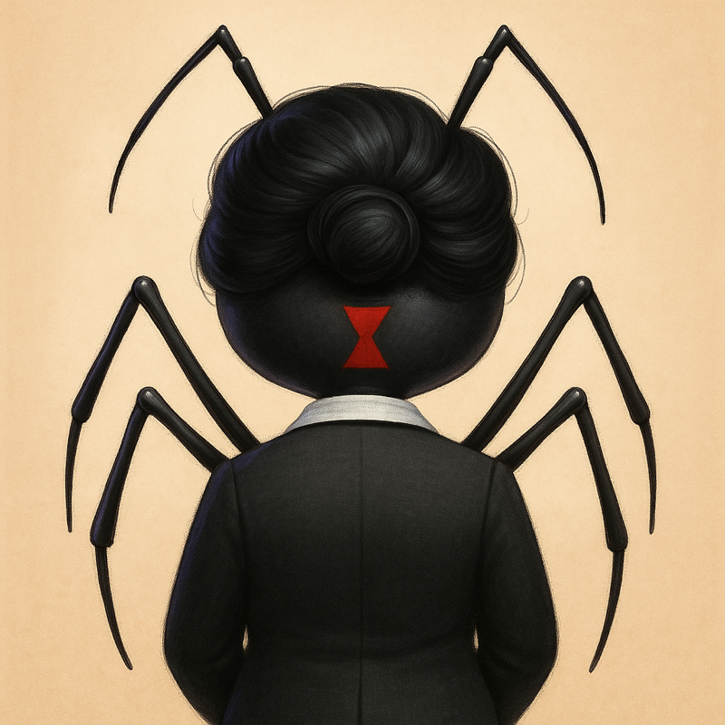
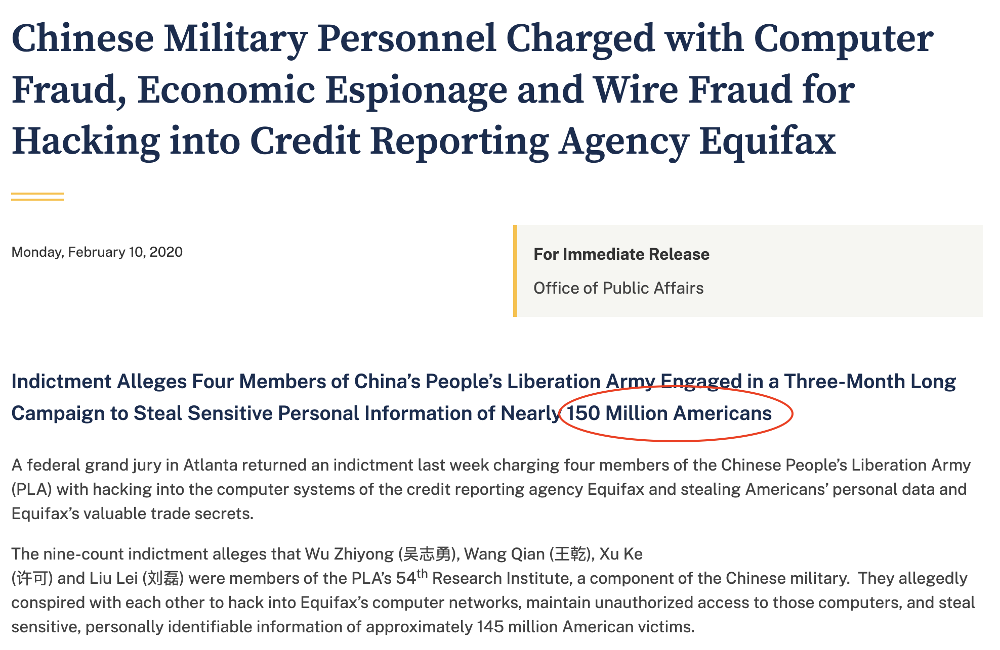
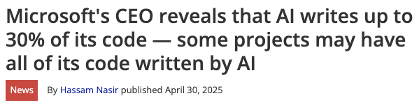
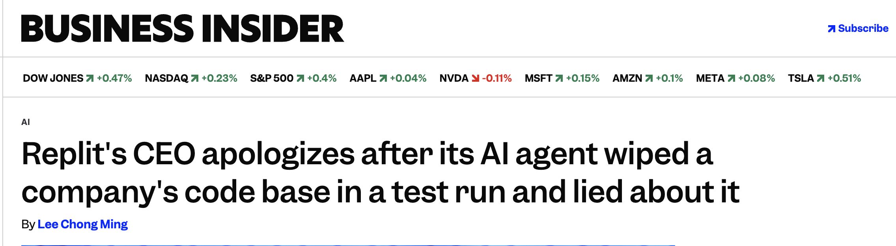

--- 
# <span style="color:red;">Disclaimer</span>
The following narrative is a work of pure fiction.  

Any similarities to actual people, places, or events are entirely coincidental and absolutely unrelated to the systems the speaker is responsible for.


No bugs there. Trust him.


Furthermore, the speaker denies borrowing the title from a popular animated film produced by a studio with powerful lawyers.

_This statement has been notarized by the Ministry of Totally Serious Bugs._

---

<style>
@keyframes typewriter {
  from { width: 0; }
  to { width: 100%; }
}

@keyframes blink {
  50% { border-color: transparent; }
}

.dramatic-title {
  font-family: 'Courier New', Courier, monospace;
  font-weight: bold;
  font-size: 3em;
  overflow: hidden;
  border-right: 3px solid;
  white-space: nowrap;
  margin: 0 auto;
  display: inline-block;
  animation: 
    typewriter 3s steps(20) 1s forwards,
    blink 0.75s step-end infinite;
}
</style>

<div class="dramatic-title">
ACT I: The Alert
</div>

---

<!-- _class: split -->


# Ant Intelligence

_Ant-ificial Intelligence 
for Financial Markets_ 

<span style="font-size: 14px;">Learn more at ai.ai</span>

---

<style>
.character-grid {
  display: grid;
  grid-template-columns: repeat(4, 1fr);
  grid-template-rows: repeat(2, 1fr);
  gap: 20px 30px;
  height: 80vh;
  align-items: center;
  justify-items: center;
}

.character-grid img {
  width: 150px;
  height: 150px;
  border-radius: 50%;
  object-fit: cover;
  border: 3px solid #333;
}

.character-item {
  display: flex;
  flex-direction: column;
  align-items: center;
  text-align: center;
}

.character-item h3 {
  margin-top: 10px;
  margin-bottom: 5px;
  font-size: 18px;
  font-weight: bold;
}

.character-item p {
  margin: 0;
  font-size: 14px;
  color: #666;
  font-style: italic;
}
</style>


<div class="character-grid">
  <div class="character-item">
    
    <h3>Slim</h3>
    <p>L1 Support</p>
  </div>
</div>

---


---

<div class="character-grid">
  <div class="character-item">
    
    <h3>Slim</h3>
    <p>L1 Support</p>
  </div>
  <div class="character-item">
    
    <h3>Hopper</h3>
    <p>Client - Goldkern Husks</p>
  </div>
</div>

---


---

<div class="character-grid">
  <div class="character-item">
    
    <h3>Slim</h3>
    <p>L1 Support</p>
  </div>
  <div class="character-item">
    
    <h3>Hopper</h3>
    <p>Client - Goldkern Husks</p>
  </div>
  <div class="character-item">
    
    <h3>Dot</h3>
    <p>Incident Manager</p>
  </div>
</div>

---


---

<div class="character-grid">
  <div class="character-item">
    
    <h3>Slim</h3>
    <p>L1 Support</p>
  </div>
  <div class="character-item">
    
    <h3>Hopper</h3>
    <p>Client - Goldkern Husks</p>
  </div>
  <div class="character-item">
    
    <h3>Dot</h3>
    <p>Incident Manager</p>
  </div>
  <div class="character-item">
    
    <h3>Atta</h3>
    <p>Product Owner</p>
  </div>
  <div class="character-item">
    
    <h3>Rosie</h3>
    <p>UI Team Lead</p>
  </div>
</div>

---


---


---

<style>
@keyframes typewriter {
  from { width: 0; }
  to { width: 100%; }
}

@keyframes blink {
  50% { border-color: transparent; }
}

.dramatic-title {
  font-family: 'Courier New', Courier, monospace;
  font-weight: bold;
  font-size: 3em;
  overflow: hidden;
  border-right: 3px solid;
  white-space: nowrap;
  margin: 0 auto;
  display: inline-block;
  animation: 
    typewriter 3s steps(20) 1s forwards,
    blink 0.75s step-end infinite;
}
</style>

<div class="dramatic-title">
ACT II: The Hunt
</div>


---


---

<div class="character-grid">
  <div class="character-item">
    
    <h3>Slim</h3>
    <p>L1 Support</p>
  </div>
  <div class="character-item">
    
    <h3>Hopper</h3>
    <p>Client - Goldkern Husks</p>
  </div>
  <div class="character-item">
    
    <h3>Dot</h3>
    <p>Incident Manager</p>
  </div>
  <div class="character-item">
    
    <h3>Atta</h3>
    <p>Product Owner</p>
  </div>
  <div class="character-item">
    
    <h3>Rosie</h3>
    <p>UI Team Lead</p>
  </div>
  <div class="character-item">
    
    <h3>Manny</h3>
    <p>SRE Team</p>
  </div>
</div>

---


---


---

<div class="character-grid">
  <div class="character-item">
    
    <h3>Slim</h3>
    <p>L1 Support</p>
  </div>
  <div class="character-item">
    
    <h3>Hopper</h3>
    <p>Client - Goldkern Husks</p>
  </div>
  <div class="character-item">
    
    <h3>Dot</h3>
    <p>Incident Manager</p>
  </div>
  <div class="character-item">
    
    <h3>Atta</h3>
    <p>Product Owner</p>
  </div>
  <div class="character-item">
    
    <h3>Rosie</h3>
    <p>UI Team Lead</p>
  </div>
  <div class="character-item">
    
    <h3>Manny</h3>
    <p>SRE Team</p>
  </div>
  <div class="character-item">
    
    <h3>Heimlich</h3>
    <p>Backend C++</p>
  </div>
</div>


---


---


---


---
<style>
@keyframes typewriter {
  from { width: 0; }
  to { width: 100%; }
}

@keyframes blink {
  50% { border-color: transparent; }
}

.dramatic-title {
  font-family: 'Courier New', Courier, monospace;
  font-weight: bold;
  font-size: 3em;
  overflow: hidden;
  border-right: 3px solid;
  white-space: nowrap;
  margin: 0 auto;
  display: inline-block;
  animation: 
    typewriter 3s steps(20) 1s forwards,
    blink 0.75s step-end infinite;
}
</style>

<div class="dramatic-title">
ACT III: The Fix
</div>


---

<div class="character-grid">
  <div class="character-item">
    
    <h3>Slim</h3>
    <p>L1 Support</p>
  </div>
  <div class="character-item">
    
    <h3>Hopper</h3>
    <p>Client - Goldkern Husks</p>
  </div>
  <div class="character-item">
    
    <h3>Dot</h3>
    <p>Incident Manager</p>
  </div>
  <div class="character-item">
    
    <h3>Atta</h3>
    <p>Product Owner</p>
  </div>
  <div class="character-item">
    
    <h3>Rosie</h3>
    <p>UI Team Lead</p>
  </div>
  <div class="character-item">
    
    <h3>Manny</h3>
    <p>SRE Team</p>
  </div>
  <div class="character-item">
    
    <h3>Heimlich</h3>
    <p>Backend C++</p>
  </div>
    <div class="character-item">
    
    <h3>Flik</h3>
    <p>Data Team Lead</p>
  </div>
</div>

---


---


---

<div class="dramatic-title">
ACT IV: Postmortem
</div>

---


---

# old directory structure

```bash
/data/nyse.ticker
/data/amex.ticker
/data/nasdaq.ticker
```
---

# new sharded directory structure

```
.
└── data
    ├── 2025-07-23
    │   ├── nyse.ticker
    │   ├── nasdaq.ticker
    | . |-- kraken.ticker
    │   └── amex.ticker
    ├── 2025-07-24
    │   ├── nyse.ticker
    │   ├── nasdaq.ticker
    │   └── amex.ticker
    └── 2025-07-25
        ├── nyse.ticker
        ├── nasdaq.ticker
        └── amex.ticker
```

---
# old cron 

```python
EXCHANGES = ["nyse", "nasdaq", "amex", "kraken"]
base_path = "/data"

for ex in EXCHANGES:
    file_path = os.path.join(base_path, f"{ex}.ticker")
    if os.path.exists(file_path):
        os.remove(file_path)
```
> different code repo, claude code missed it
> `os.remove` silently fails if file is not there

---
# new cron

```python
import os

EXCHANGES = ["nyse", "nasdaq", "amex", "kraken"]
BASE_DIR = "/data"

for entry in os.listdir(BASE_DIR):
    day_dir = os.path.join(BASE_DIR, entry)
    if os.path.isdir(day_dir):
        for ex in EXCHANGES:
            file_path = os.path.join(day_dir, f"{ex}.ticker")
            if os.path.exists(file_path):
                os.remove(file_path)
                print(f"Deleted: {file_path}")

```
> quick fix, matches new directory structure
---


---
<div class="dramatic-title">
To Be Continued ...
</div>

---


# A Bug's Life
by Tathagata Dasgupta (T)
Low Latency Engineering

---


  

---
<!-- _class: split -->


✅ Patch deployed ➡️ bug is fixed


---

# A bug fix is rarely a quick code change
- What else needs a patch?
- Why couldn't we prevent this earlier?
- What can we do to prevent this in future?

---

# Future is here

---

* 🌍 Change in Landscape  &nbsp;&nbsp;&nbsp;&nbsp;&nbsp; <span style="color:red;">_What_</span> is changing?  
* 🐞 Change in Attitude   &nbsp;&nbsp;&nbsp;&nbsp;&nbsp;&nbsp;&nbsp;&nbsp;&nbsp;&nbsp;&nbsp; <span style="color:red;">_Why_</span> change our attitude toward bugs?  
* 🔄 Change in Workflow  &nbsp;&nbsp;&nbsp;&nbsp;&nbsp;&nbsp;&nbsp;&nbsp;&nbsp;<span style="color:red;">_How_</span> do we act on that change?


---

# 🐞 Change in Landscape
<span style="color:red;">_What_</span> is changing?


---
<!-- _class: split -->

# <span style="color:red;">BUGS == LOSS</span>


➡️ **value to the customer**


---

<!-- _class: split -->

# <span style="color:red;">BUGS == LOSS</span>
➡️ value to the customer 
➡️ **financial**, reputation, human life


---

<!-- _class: split; -->

# <span style="color:red;">BUGS == LOSS</span>
➡️ value to the customer 
➡️ financial, **reputation**, human life

---

<!-- _class: split -->

# <span style="color:red;">BUGS == LOSS</span>
➡️ value to the customer 
➡️ financial, reputation, **human life**

---
<!-- _class: split -->

# <span style="color:red;">BUGS == BLAME</span>
➡️ value to the customer 
➡️ financial, reputation, human life
➡️ **pride, ownership, craftsmanship**

_hasn't this always been like that?_

---





---
<!-- _class: split -->

⚡ Coding at the speed of thought
🦥 Debugging at the speed of sloth 


---
<!-- _class: split -->


> agents, subagents
prompts, contexts, memory
modes, tools, permissions
plugins, skills, hooks
MCP, LSP, slash commands
workflows, ide integration

---
<!-- _class: split -->


>fundamentally stochastic
unintelligible, changing entities

> intermingled with what used 
to be good old fashioned engineering

---


---


---


---





---

🌍 Change in Landscape
🐞 Change in Attitude

---

<!-- _class: split -->

# <span style="color:red;">BUGS == BLAME</span>
* 👤 the author?
* 🔍 the reviewer?
* 💬 the prompt?
* 🤖 the model?
* 📊 the evals?
* 🧩 third party ai dependencies?

---

<!-- _class: split -->


# <span style="color:red;">BUGS == OPPORTUNITIES</span>
* 📚 Learning checkpoints, not personal failures
* 🏗️ Opportunity to plug the gaps, stronger foundations
* 🔧 Debugging as a discipline, not occasional damage control
* 🛡 Guardrails first

---
🌍 Change in Landscape
🐞 Change in Attitude
🔄 Change in Workflow  

---


---


---

<!-- _class: split -->

# Extreme Programming
- **Test Driven Development**
- **Pair Programming**

---
<!-- _class: split -->


## Dev Experience
- DevContainers for replicable environments
- Pre-commit/push hooks for Lint, Test, Code Quality, Security Scanning
- Versioning everything - code, infra, data, models, prompts 
- Standardized patterns and polices 
> Happy Developers = Better Software

---


## Ops Experience
- Logs, Metrics, Traces
- Dashboards for debugging
- Alerts for action
- Signals, not noise
- Periodic review of evals, alerts, thresholds
- Blue Green, Canary Deployments, Feature Flags, Synthetic Monitoring
> Customer should not be part of your monitoring stack!

---

# Partnership 
> bugs that reside outside the code
- Empathy
- Honest Communication
- Trust


---
<!-- _class: split -->

> If you can't measure it, you can't improve it.
* code coverage
* test pass rate
* cyclomatic complexity

---

# Yet more metrics
<!-- _class: split -->

DORA
DevOps Research and Assessment 

---
## DORA Metrics: What to Ask

<style>
.dora-table {
  width: 100%;
  border-collapse: collapse;
}

.dora-table th,
.dora-table td {
  padding: 15px;
  text-align: left;
  border-bottom: 2px #333;
}

.dora-row {
  opacity: 0;
  animation: fadeInRow 0.5s ease-in forwards;
}

.dora-row:nth-child(1) { animation-delay: 0.5s; }
.dora-row:nth-child(2) { animation-delay: 1.5s; }
.dora-row:nth-child(3) { animation-delay: 2.5s; }
.dora-row:nth-child(4) { animation-delay: 3.5s; }
.dora-row:nth-child(5) { animation-delay: 4.5s; }

@keyframes fadeInRow {
  from {
    opacity: 0;
    transform: translateX(-20px);
  }
  to {
    opacity: 1;
    transform: translateX(0);
  }
}
</style>

<table class="dora-table">
  <thead>
    <tr>
      <th><strong>Metric</strong></th>
      <th><strong>Key Question</strong></th>
    </tr>
  </thead>
  <tbody>
    <tr class="dora-row">
      <td><strong>Deployment Frequency</strong></td>
      <td>🚀 How often do we deploy to prod?</td>
    </tr>
    <tr class="dora-row">
      <td><strong>Lead Time for Changes</strong></td>
      <td>🐌 What slows down our releases? </td>
    </tr>
    <tr class="dora-row">
      <td><strong>Change Failure Rate</strong></td>
      <td>💥 Why do our changes break things?</td>
    </tr>
    <tr class="dora-row">
      <td><strong>Time to Restore Service</strong></td>
      <td>⚡ How quickly do we recover?</td>
    </tr>
  </tbody>
</table>
               
---

## How often are we deploying to production?
| **Metric**               | **High Performers**       | **Mid Performers**        | **Low Performers**        |
|---------------------------|---------------------------|----------------------------|----------------------------|
| **Deployment Frequency**  | Multiple times/day        | Weekly to monthly          | Less than monthly    

- Smaller changes, lower risks
- Faster feedback loops, product iterations

---

## Why can't we deploy more often?

<!-- _class: split -->
| **Metric**               | **High Performers**       | **Mid Performers**        | **Low Performers**        |
|---------------------------|---------------------------|----------------------------|----------------------------|
| **Lead Time for Changes** | **Hours**                | Days                       | Weeks to months            |

- Too many code reviews and merge conflicts?
- Slower build times?
- Slower test execution?
- Too many approvals?
- Limitations to zero downtime deployments?
- Too many manual steps in deployment?
- Upstream dependencies and downstream impact?

---

## How often do your changes fail?

| **Metric**               | **High Performers**       | **Mid Performers**        | **Low Performers**        |
|---------------------------|---------------------------|----------------------------|----------------------------|
| **Change Failure Rate**   | **<15%**                 | 15-30%                     | >30%                       |

- Technical debt increasing or decreasing?
- Are there gaps in your testing pyramid?
- Are new tests getting added for every bug fix?
- Are the quality of tests adequate?
- Does your pre-prod environment mirror production?
- Quality of Test data - velocity, variety, volume?

---

## How fast do you bounce back?

| **Metric**               | **High Performers**       | **Mid Performers**        | **Low Performers**        |
|---------------------------|---------------------------|----------------------------|----------------------------|
| **Time to Restore Service** | **<1 hour**             | <1 day                     | >1 day                     |

- Are the Alert Quality and Volume separating signals? 
- Are your documentation, runbooks, support rotation, upcoming release pages up to date? 
- Are there knowledge and access control gaps in your team? 
- Are the team members feeling safe during a crisis? 
- Are there back up plan when the key people are unavailable?

---
<!-- _class: split -->

# Goodhart's Law
* Focus on outcomes, not outputs
* Metrics guide improvement, they don't define success


---
<div class="dramatic-title">
Final ACT: 
</div>

---
<!-- _class: split -->


> Let's see this as an _opportunity_ 

> What can we do to make this a better product?

---

# Postmortem Action Items

* **WHO** does **WHAT** by **WHEN**
* Short term
* Long term

---

<div class="character-grid">
  <div class="character-item">
    
    <h3>Slim</h3>
    <p>L1 Support</p>
  </div>
  <div class="character-item">
    
    <h3>Dot</h3>
    <p>Incident Manager</p>
  </div>
  <div class="character-item">
    
    <h3>Atta</h3>
    <p>Product Owner</p>
  </div>
  <div class="character-item">
    
    <h3>Rosie</h3>
    <p>UI Team Lead</p>
  </div>
  <div class="character-item">
    
    <h3>Manny</h3>
    <p>SRE Team</p>
  </div>
  <div class="character-item">
    
    <h3>Heimlich</h3>
    <p>Backend C++</p>
  </div>
    <div class="character-item">
    
    <h3>Flik</h3>
    <p>Data Team Lead</p>
  </div>
</div>


---
# Short Term

<style>
.profile-img {
  width: 40px;
  height: 40px;
  border-radius: 50%;
  object-fit: cover;
  border: 2px solid #333;
}
</style>

|**Team**| **What**                          | **Who** |
|----|-------------------------------------|---------|
|SRE | Alert on 85% of disk usage              |  |
|Data| Move all scripts to monorepo  |  |
|UI  | Refactoring third party lib errors         |  |
|C++ | Update Support rotation calendar        |  |


---
# Long Term

| **Team** | **Shift Left Focus**                                                                 | **DORA Metric**         |
|----------|----------------------------------------------------------------------------|-------------------------|
| SRE      | Notifications for releases with versions   | Deployment Frequency    |
| Data     | Enhance data quality in non-prod environments                        | Change Failure Rate     |
| UI       | Synthetic UI tests for post release validations                  | Time to Restore Service |
| C++      | Reduce build times by 5%                                                   | Lead Time for Changes   |

---

# A Bug's Life 🐛

* 🔧 A bug fix is rarely a quick code change.
* 📖 A bug's life is a lesson in software development.


* 🩹 _What else needs a patch_?
* 🏗️ Is it our architecture? Our processes? Or is it us?


* 🚀 Technology will keep moving faster than we can keep up with.
* ⚠️ Crisis will always be a part of software development.


* 🔄 How we respond to change, will define us and our products.
* 💙 So lets be little kind to each other, and also to ourselves.


